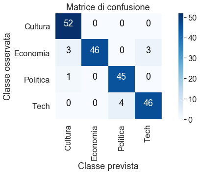

# Analisi generale progetto Big Data, Alessandro Stefani, Cristi Gutu.
### Il progetto tratta il problema della classificazione nella rispettiva categoria di news reperite dall'agenzia ANSA.it 

#### Importazione funzioni processamento articoli


```python
from AC import preproc
from AC import get_news
import inspect
%load_ext autoreload
%autoreload 2
```

### Ottenimento articoli per ogni categoria


```python
economia = get_news("./articoli_economia/")
cultura = get_news("./articoli_cultura/")
tech = get_news("./articoli_tech/")
politica = get_news("./articoli_politica/")
for articolo in economia:
    articolo['categoria'] = "Economia"
for articolo in cultura:
    articolo['categoria'] = "Cultura"
for articolo in tech:
    articolo['categoria'] = "Tech"
for articolo in politica:
    articolo['categoria'] = "Politica"
dati_preprocessati =  preproc(tech + politica + cultura + economia)
```

    [nltk_data] Downloading package stopwords to
    [nltk_data]     C:\Users\Cristy\AppData\Roaming\nltk_data...
    [nltk_data]   Package stopwords is already up-to-date!
    100%|██████████| 799/799 [00:10<00:00, 72.86it/s] 
    


```python
from AC import distribuzione_frequenze
```

### Importazione moduli necessari per la suddivisione dell'insieme di news in train e test


```python
from sklearn.feature_extraction.text import CountVectorizer,TfidfVectorizer
from sklearn.decomposition import LatentDirichletAllocation
from sklearn.model_selection import train_test_split
from sklearn import linear_model,metrics
from sklearn.dummy import DummyClassifier
from sklearn.discriminant_analysis import LinearDiscriminantAnalysis
from sklearn.discriminant_analysis import QuadraticDiscriminantAnalysis
from sklearn.tree import DecisionTreeClassifier

```

### Suddivisione news in insieme di training e test


```python
seed = 2
train_documents,test_documents = train_test_split(dati_preprocessati,random_state=seed)
```

### Costruzione della term document matrix e calcolo distribuzione Document Frequency


```python
docs_texts = [' '.join([word for word in x['testo']] + x['tags'] + x['sottotitolo'] + x['titolo_articolo']) for x in dati_preprocessati]
train_texts = [' '.join([word for word in x['testo']] + x['sottotitolo'] + x['titolo_articolo']) for x in train_documents]
test_texts = [' '.join([word for word in x['testo']] + x['sottotitolo'] + x['titolo_articolo']) for x in test_documents]

docs_cats = [x["categoria"] for x in dati_preprocessati]
train_cats = [x["categoria"] for x in train_documents]
test_cats = [x["categoria"] for x in test_documents]

distribuzione_frequenze(train_texts,"train")
distribuzione_frequenze(test_texts,"test")
```


 
## Costuzione pipeline, che esclude preprocessamento


```python
from sklearn.pipeline import Pipeline
#clsfr = linear_model.LogisticRegression(random_state=0,solver='lbfgs',multi_class='multinomial')
clsfr = DecisionTreeClassifier()
ldac = Pipeline([
    ("count_mx",CountVectorizer(ngram_range=(1,6), min_df=8,max_df=0.9,encoding='utf-8',max_features=100000, lowercase=True)),
    ("lda", LatentDirichletAllocation(n_components=16,max_iter=50, learning_method='online',random_state=0)), 
    ("classifier",clsfr)
])

```

### Fitting term document matrix via Latent Dirichlet Allocation


```python
ldac.fit(train_texts,train_cats)
```


    Pipeline(memory=None,
         steps=[('count_mx', CountVectorizer(analyzer='word', binary=False, decode_error='strict',
            dtype=<class 'numpy.int64'>, encoding='utf-8', input='content',
            lowercase=True, max_df=0.9, max_features=100000, min_df=8,
            ngram_range=(1, 6), preprocessor=None, stop_words=None,
           ...      min_weight_fraction_leaf=0.0, presort=False, random_state=None,
                splitter='best'))])


## Predizione via Alberi di classificazione con insieme di test, e Costruzione matrice di confusione 


```python
from sklearn.utils.multiclass import unique_labels
import matplotlib.pyplot as plt
from sklearn.metrics import confusion_matrix
from itertools import product

```


```python

pred_cats = ldac.predict(test_texts)

classi = unique_labels(test_cats, pred_cats)
plt.title("Matrice di confusione")
cm = confusion_matrix(test_cats, pred_cats)
    
plt.imshow(cm, interpolation='nearest', cmap=plt.cm.Blues)
plt.colorbar(fraction=0.04, pad=0.1)#spazi occupati dalla barra a destra

#labels 
tick_marks = range(len(classi))
plt.xticks(tick_marks, classi, rotation=90)
plt.yticks(tick_marks, classi)
    
plt.grid(None)
plt.ylabel("Classe osservata")
plt.xlabel("Classe prevista")

thresh = cm.max() / 2
#colore dei numeri dentro i quadrati
for i, j in product(range(cm.shape[0]), range(cm.shape[1])):
    plt.text(j, i, format(cm[i, j], 'd'), horizontalalignment="center", color="white" if cm[i, j] > thresh else "black")
```





## Accuratezza ottenuta


```python
print(metrics.accuracy_score(pred_cats, test_cats)) 

```

    0.945
    
